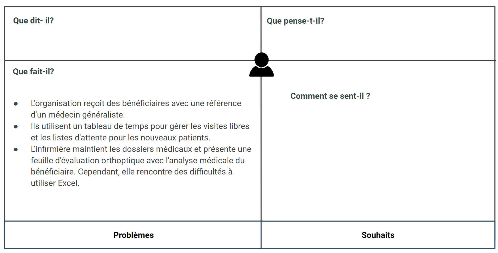
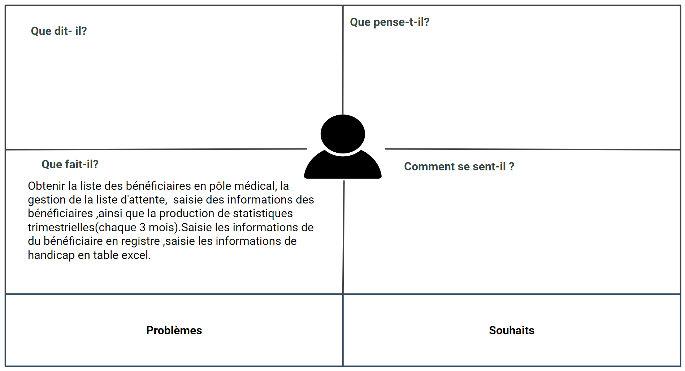
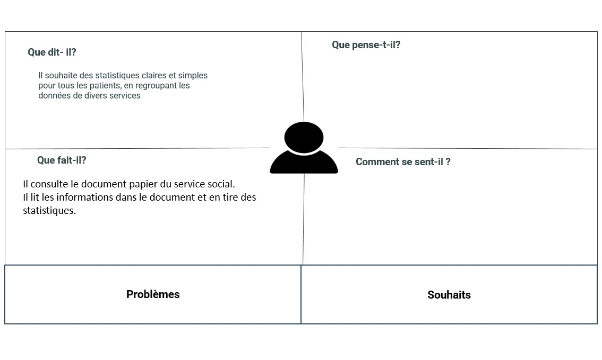

# Document markdown
## Définir le problème

Le problème est que le centre CNMH manque un système efficace de gestion des données, ce qui entraîne des difficultés dans la génération de rapports précis et complets. Chaque département du centre utilise des méthodes traditionnelles de tenue de registres sur papier et à la plume, et seuls quelques-uns utilisent des feuilles de calcul Excel. Cela rend difficile et chronophage pour la directrice de rassembler les données dont elle a besoin périodiquement. Par conséquent, les rapports générés peuvent ne pas refléter avec précision le travail effectué par le centre et ne pas mettre en valeur leurs réalisations.

Le centre CNMH manque d'un système efficace de gestion des données, ce qui entraîne des difficultés dans la génération de rapports précis et complets.

## Idéation
Créer une application conviviale pour le centre CNMH en utilisant Laravel, Bootstrap et AdminLTE. Cette application permettra une gestion plus efficace des données et une génération améliorée de rapports, avec une interface facile à utiliser pour les employés.

## Empathie avec service social

### Persona
Khawla souan

### Ce qu'il dit 
- a  l’accueil ( réception au visiteur de centre - repondre a leurs questions)
- après entretien social ils l'enregistrent ou pas  selon leur condition (est ce qu'ils ont une handicapé ou pas) création de dossier social(tout les informations du patient avec N°A…) 
- remplir bon d’orientation(date inscription,Dossier social N°A…,Nom et Prénom du bénéficiaire)
- Gestion des rendez-vous
- dossier ça reste en liste d’attente enregistrement
- dossier va passer à l'infirmière

### Faire
- Affiche les information en table exel :
  - N dossier
  - Nom
  - Prénom
  - Sexe
  - TH
  - Date naissance
  - Age
  - Couverture médicale
  - cnops
  - cnss
  - ramed
  - assurance
  - FAR
  - Sans
  - Date enregistrement
  - Date entrée

## Empathie avec infirmière de médecine général 

### Persona
Algamot asia

### Ce qu'il dit : 
- Elle dit que en tant qu'infirmière en médecine générale, elle doit accomplir plusieurs tâches,  notamment : 
- Remplir un dossier médico-social 
- Mise en charge (date inscription,nom prénom,numéro dossier,conclusion clinique,orientation)
- Remplir des chose en dossier patient
- Après envoyé dossier à médecine pour continuer la remplir de dossier

### Ce qu’il fait :
- Apprendre à travailler avec Excel afin d'améliorer la façon dont elle insère les données
- Nous Donne un dossier médico-socio 

## Empathie avec service de rééducation (Orthoptiste)

### Persona : 
Imane Errahmouni

### Ce qu'il dit : 
- nous recevons les bénéficiaires accompagnés de leur bon d’orientation suivi par le médecin généraliste.
- à l'aide d'un tableau de temps composé de deux parties :
- une pour les bénéficiaires en visite libre sans rendez-vous.
- la seconde pour que les nouveaux soient mis sur la liste d'attente et appelés par le service social.
- le dossier médical est gardé par l'infirmière pour consigner les données,
- nous présentons une feuille dite <<BILAN ORTHOPTIQUE>>  décrivons les données et l'analyse médicale du bénéficiaire.
- au début elle gère ce tableau sur papier  puis elle a switché vers l'outil Excel, or elle trouve des difficultés à travailler avec ce dernier

### Ce qu’il fait : 
- Numéro d’ordre 
- Date
- Numéro dossier 
- ACTES RELISES
- BILAN ORTHOPTIQUE
- NV CAS
- ANC CAS
- TRAITEMENT D’AMBLYOPIE
- REEDUCATION ORTHOPTIQUE
- CHAMP VISUEL
- AUTRES
- ACTES NON REALISES
- ABSENCE
- NON COOPERANT 
- AUTRE
- OBSERVATION
- RH

## Empathie avec service de rééducation (psychomotricien)

### Persona
SALMA LIKRAM

### Ce qu'il dit : 
- prendre liste des personnels bénéficiaire à pôle médical
- Gestion de liste d'attente 
  - Gestion des rendez-vous
  - Informer le service social
- Statistique pour chaque 3 mois en table exel

### Ce qu’il faire :
- Saisie les informations de handicap
  - N° du dossier
  - Nom et Prénom
  - Pathologies/houbles
  - Observation
- Saisie les informations de handicap en table excel
  - Date d’entrée
  - N° du dossier
  - Nom et Prénom
  -  Age
  - Diagnostic
  - Présence avec date et nb séance
  - Remarque

## Empathie avec assistant dentaire médecin spécialiste Interne

### Persona
Tallaoui sanae

### Ce qu'il dit:
- Création de dossier - Cabinet dentaire
  - Numéro d’ordre 
  - Numéro dossier 
  - Nom
  - Prénom
  - Date de Naissance
  - N° de téléphone
  - Diagnostic
  - Activité dentaire
- Gestion de liste d'attente 
  - Gestion des rendez-vous
  - Informer le service social

### Ce qu’il faire:
- Nous fournir un exemple de dossier médico-social(cabinet dentaire)+ un exemple de carte de dentisterie (Numéro dossier,Nom,Prénom, ge,Diagnostic , (Jour - date - heure) )

## Empathie avec service de rééducation (Kinésithérapeute)

### Persona : 
Nassima El Ouazzani

### Ce qu'il dit : 
- Elle utilise différentes méthodes pour gérer son travail.
- Elle utilise un registre dans lequel elle note le numéro d'ordre général depuis qu'elle a commencé à travailler, le numéro d'ordre annuel, la date de visite, le nom et prénom du patient, le type de handicap, le numéro de téléphone, le numéro de dossier et ses observations.
- Elle utilise également un agenda pour gérer les séances avec les patients.
- Elle a commencé à travailler sur Excel pour noter la date, le numéro de dossier, la séance de bilan, le compte rendu du bilan (fait ou en attente), le numéro de la séance de travail, le compte rendu final, le taux de réalisation des objectifs et le nom du kinésithérapeute.
- Cependant, elle a arrêté d'utiliser Excel en raison de la demande d'activation.

## Empathie avec service de rééducation (Ergothérapeute)

### Persona 
Alaoui Ghita

### Ce qu'il dit : 
- Pour créer sa propre liste d'attente, elle commence par aller voir l'infirmière généraliste et note dans un registre le numéro de dossier, le nom, le prénom, la date de naissance et le numéro de téléphone des bénéficiaires sur la liste d'attente.
- Elle utilise Excel pour enregistrer des informations telles que la date, le numéro d'ordre d'appel, le numéro d'ordre de la séance, le numéro de dossier, le nom et prénom du patient, le diagnostic, le type de séance, le numéro de la séance, la présence (après 3 absences injustifiées, le patient retourne sur la liste d'attente) et ses observations.
- Après avoir mené ses séances, elle ajoute un bilan dans le dossier médical du patient.
- Elle écrit également des statistiques mensuelles sur un petit papier, notamment le nombre total d'actes, le nombre total d'absences, le nombre total de cas pris en charge (PEC) et le nombre total d'orientations.

## Empathie avec service de rééducation (psychologue)

### Persona 
Anas Mjadli

### Ce qu'il dit : 
- Le psychologue est nouveau dans le centre CNMH et n'est pas encore un employé permanent.
- La première fois qu'il travaille avec un patient, il examine son dossier médical.
- Son rôle consiste à effectuer des séances avec les parents et les patients du centre.
- Après avoir mené les séances et tiré ses conclusions, il établit un bilan psychologique sur le patient.
- Il garde beaucoup de données confidentielles en raison de la nature de son travail et des sujets personnels qu'il discute avec les patients.
- Il n'a aucun problème à gérer son travail et n'est pas encore tenu de fournir des chiffres pour les statistiques.
- Il utilise des produits numériques tels que Google Sheets et Google Forms pour gérer son travail, même s'il n'y est pas obligé, pour des raisons d'organisation.

## Empathie avec service de rééducation (orthophoniste)

### Persona
SAMIA KABBAJ

### Ce qu'il dit : 
- Get liste des personnels bénéficiaire à pôle médical
- Gestion de liste d'attente 
- Gestion des rendez-vous
- Informer le service social

### Ce qu’il faire :
- Saisie les informations de handicap
  - Date
  - N° du dossier
  - Nom et Prénom
  - Sexe
  - Age
  - Diagnostic
  - Présence
  - Nombre de séance->S1

## Empathie avec la directrice

### Persona : 
Fatima Zohra Serghini

### Ce qu'il dit : 
- Je veux voir les statistiques de la manière la plus simple et claire possible, tout en un seul endroit. 
- Je souhaite obtenir des statistiques pour tous les patients, incluant toutes les informations des autres services.

### Ce qu’il fait : 
- Il consulte le document papier du service social.
- Il lit les informations dans le document et en tire des statistiques